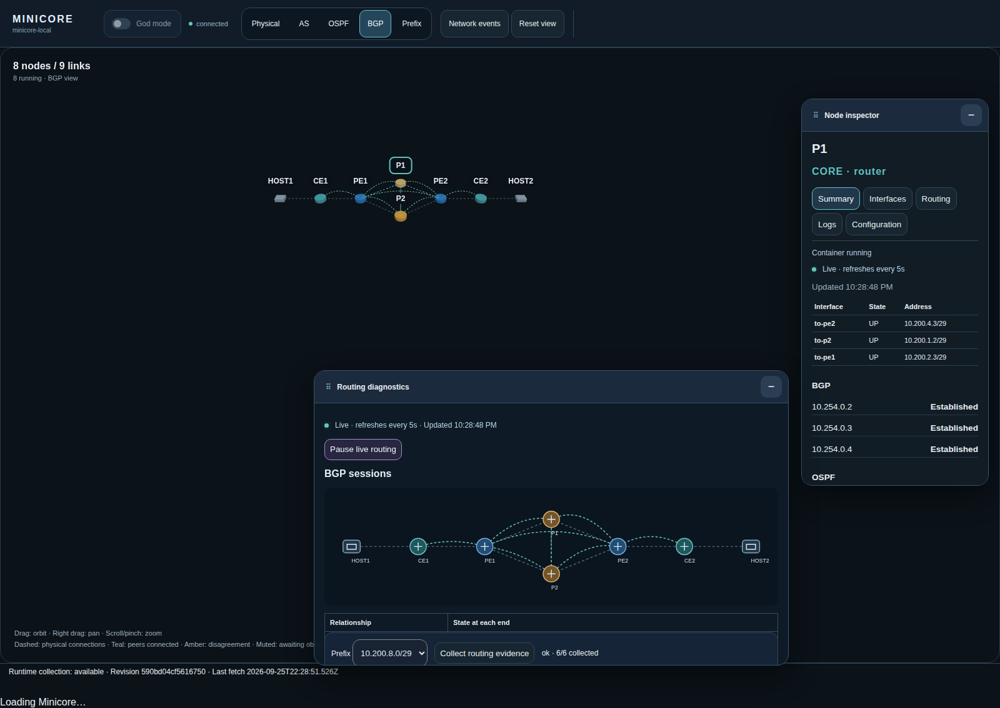

# Minicore



Minicore is an IP network simulator with six FRRouting routers, two packet endpoints and nine data links. It combines live routing diagnostics, a 3D workbench, restricted MCP tools and reversible faults for troubleshooting exercises.

## Features

- **Real routing:** OSPF, a provider iBGP full mesh and two access eBGP sessions, with Linux forwarding and isolated data links.
- **3D workbench:** selectable nodes and links, movable and minimisable inspectors, keyboard controls and an accessible fallback. Diagnostic panels contain 2D graphs and tables.
- **Live evidence:** interfaces, BGP/OSPF neighbours, routes, exact-prefix BGP/RIB/FIB comparisons, streaming container logs and a read-only configuration browser.
- **Network events:** interface rates, routing changes and filtered IGMP signalling in a memory-only 60-second window.
- **MCP diagnostics:** six Operator tools for inventory, interfaces, routes, neighbours, bounded probes and shared evidence. Four additional God tools control fixed faults and recovery.
- **Fault exercises:** stop a node or link, apply a reversible delay, loss or prefix blackhole, then restore and verify the baseline. Inspection and fault controls are separate.
- **Restricted execution:** non-root management without Linux capabilities or a Docker socket; pinned, forced-command SSH; an optional inventory-bound host service for whole-node faults.
- **Executable tests:** Gherkin acceptance, browser tests, independent MCP clients, packet-path isolation and interrupted-fault recovery checks.

## Run locally

Requires Linux amd64, Docker Engine 28+, Compose 2.36+, Bun 1.4.1, Python 3.12+ with venv/pip, Make and user-systemd. Host provisioning uses sudo for UID/GID 10001 permissions.

```sh
make bootstrap generate
make acceptance
make router-build build
bun scripts/init-secrets.ts       # once; refuses to overwrite credentials
sudo chown 10001:$(id -g) secrets/http/mcp-tokens.json
sudo chmod 640 secrets/http/mcp-tokens.json
make ssh-provision lab-up up watch-logs
```

Open **http://127.0.0.1:19000**. MCP uses **http://127.0.0.1:19000/mcp**. The default private profile grants anonymous Operator access on loopback. God always requires its own credential. Use `MINICORE_EXPOSURE_PROFILE=authenticated make up` to require authentication for all access. Remote access requires TLS and source filtering; never publish the unauthenticated private profile.

Enable targeted God browser controls with:

```sh
make host-fault-start
MINICORE_HOST_FAULT_SOCKET=/run/host-control/fault.sock make up
```

Keep the socket override on subsequent `make up` calls while targeted faults are enabled. Restore the lab before stopping the host controller. See the [runbook](docs/operations/runbook.md) for observer services, credentials and recovery.

## Test

```sh
make acceptance                   # Python, host and browser acceptance
make mcp-client live-routes        # official SDK and live diagnostics
make live-faults live-recovery     # fixed faults, restart and cancellation
make live-targeted live-ui-faults  # requires the host fault service
make live-isolation               # cuts and restores provider paths
make browser-matrix
```

Run live mutation suites serially. Restart the log watcher after lifecycle tests that stop it. See the [testing methodology](docs/development/methodology.md) for test layers and the [limitations](docs/operations/known-limitations.md) for current bounds.

## Documentation

- [Specification](SPEC.md): topology, routing, security, diagnostics, faults and acceptance requirements.
- [Documentation index](docs/README.md): supporting contracts and operating instructions.
- [Runbook](docs/operations/runbook.md): installation, authentication, service lifecycle and recovery.
- [Development methodology](docs/development/methodology.md): Gherkin-first changes, test gates and coverage.
- [Dependencies and licences](docs/operations/dependencies.md).

The browser uses Preact and Three.js, built with Bun. Python and vendored uMCP serve the application through one HTTP listener. Project code is [MIT licensed](LICENSE); dependencies retain their own licences.
